# CometBFT QA Results v0.37.x

This iteration of the QA was run on CometBFT `v0.37.0-alpha3`, the first `v0.37.x` version from the CometBFT repository.

The changes with respect to the baseline, `TM v0.37.x` as of Oct 12, 2022 (Commit: 1cf9d8e276afe8595cba960b51cd056514965fd1), include the rebranding of our fork of Tendermint Core to CometBFT and several improvements, described in the CometBFT [CHANGELOG](https://github.com/airchains-network/wasmbft/blob/v0.37.0-alpha.3/CHANGELOG.md).

## Testbed

As in other iterations of our QA process, we have used a 200-node network as testbed, plus nodes to introduce load and collect metrics.

### Saturation point

As in previous iterations, in our QA experiments, the system is subjected to a load slightly under a saturation point.
The method to identify the saturation point is explained [here](TMCore-QA-34.md#finding-the-saturation-point) and its application to the baseline is described [here](TMCore-QA-37.md#finding-the-saturation-point).
We use the same saturation point, that is, `c`, the number of connections created by the load runner process to the target node, is 2 and `r`, the rate or number of transactions issued per second, is 200.

## Examining latencies

The following figure plots six experiments carried out with the network.
Unique identifiers, UUID, for each execution are presented on top of each graph.

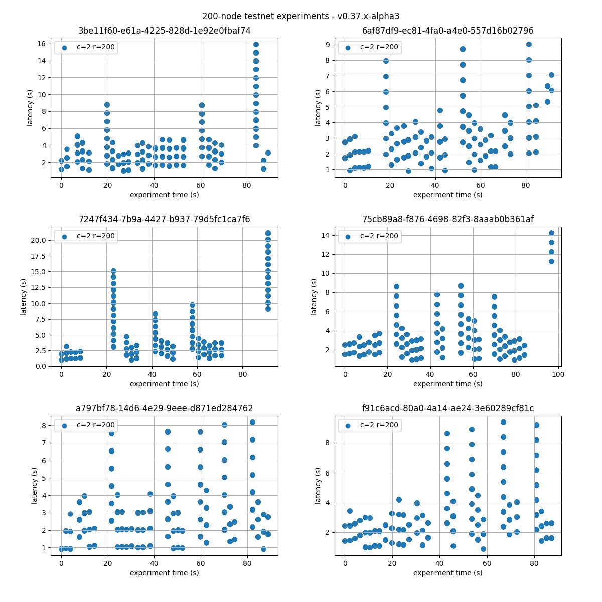

We can see that the latencies follow comparable patterns across all experiments.
Therefore, in the following sections we will only present the results for one representative run, chosen randomly, with UUID starting with `75cb89a8`.

.

For reference, the following figure shows the latencies of different configuration of the baseline.
`c=02 r=200` corresponds to the same configuration as in this experiment.

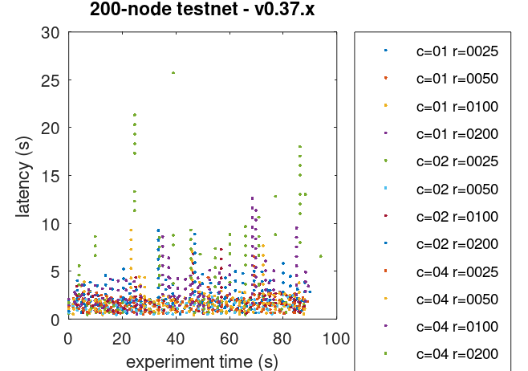

As can be seen, latencies are similar.

## Prometheus Metrics on the Chosen Experiment

This section further examines key metrics for this experiment extracted from Prometheus data regarding the chosen experiment.

### Mempool Size

The mempool size, a count of the number of transactions in the mempool, was shown to be stable and homogeneous at all full nodes.
It did not exhibit any unconstrained growth.
The plot below shows the evolution over time of the cumulative number of transactions inside all full nodes' mempools at a given time.

The following picture shows the evolution of the average mempool size over all full nodes, which mostly oscilates between 1500 and 2000 outstanding transactions.

The peaks observed coincide with the moments when some nodes reached round 1 of consensus (see below).

The behavior is similar to the observed in the baseline, presented next.

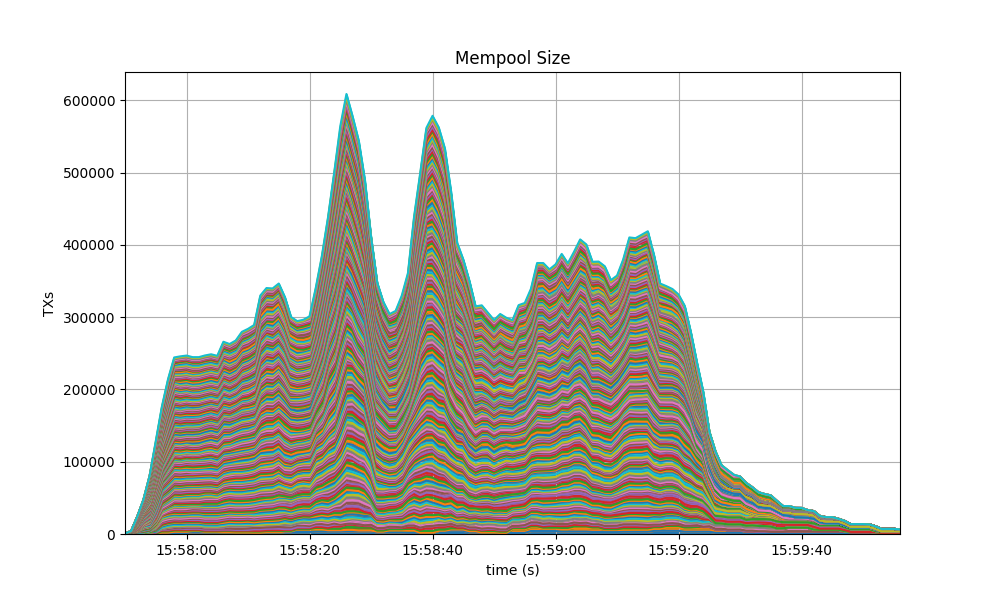

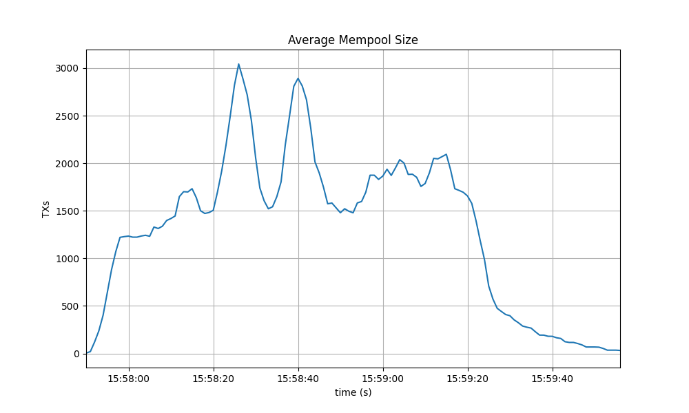

### Peers

The number of peers was stable at all nodes.
It was higher for the seed nodes (around 140) than for the rest (between 16 and 78).
The red dashed line denotes the average value.

Just as in the baseline, shown next, the fact that non-seed nodes reach more than 50 peers is due to [\#9548].

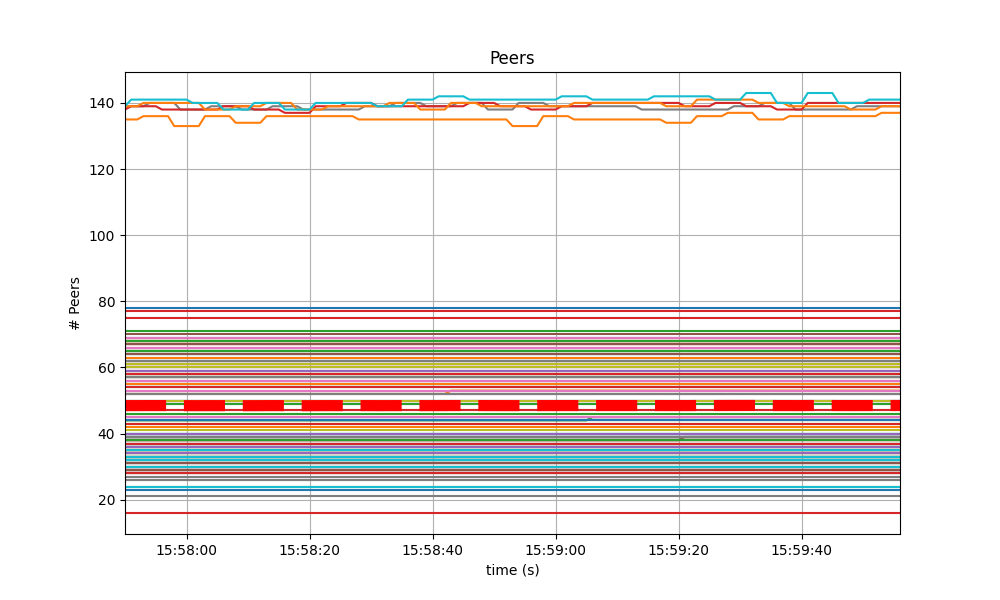

### Consensus Rounds per Height

Most heights took just one round, that is, round 0, but some nodes needed to advance to round 1 and eventually round 2.

The following specific run of the baseline presented better results, only requiring up to round 1, but reaching higher rounds is not uncommon in the corresponding software version.

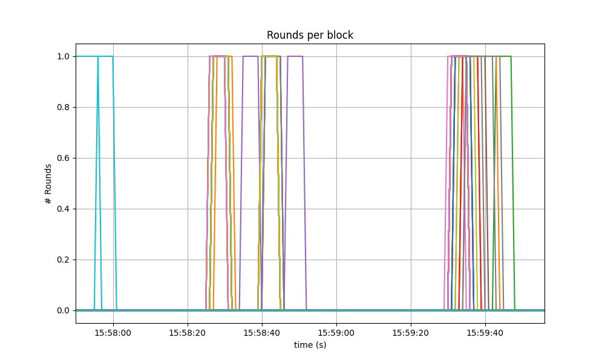

### Blocks Produced per Minute, Transactions Processed per Minute

The following plot shows the rate in which blocks were created, from the point of view of each node.
That is, it shows when each node learned that a new block had been agreed upon.

For most of the time when load was being applied to the system, most of the nodes stayed around 20 to 25 blocks/minute.

The spike to more than 175 blocks/minute is due to a slow node catching up.

The collective spike on the right of the graph marks the end of the load injection, when blocks become smaller (empty) and impose less strain on the network.
This behavior is reflected in the following graph, which shows the number of transactions processed per minute.

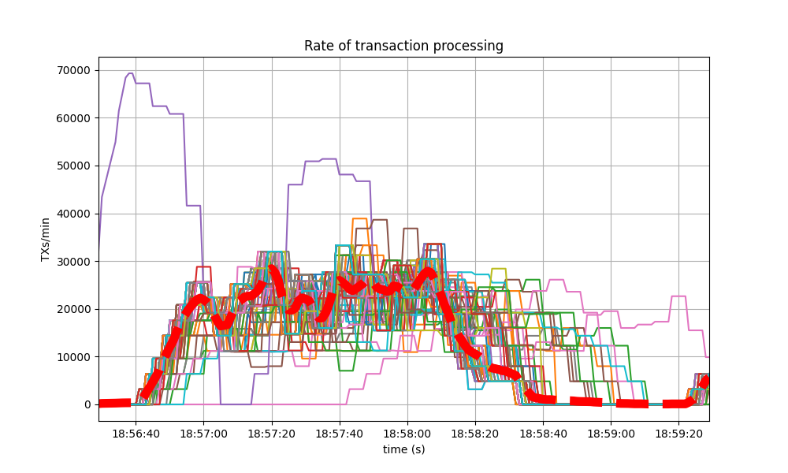

The baseline experienced a similar behavior, shown in the following two graphs.
The first depicts the block rate.

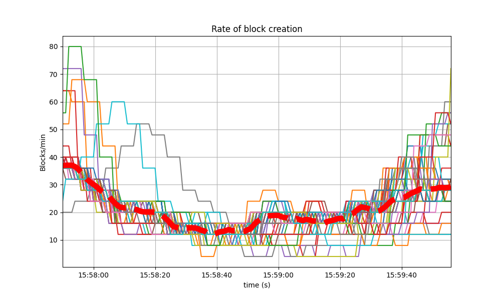

The second plots the transaction rate.

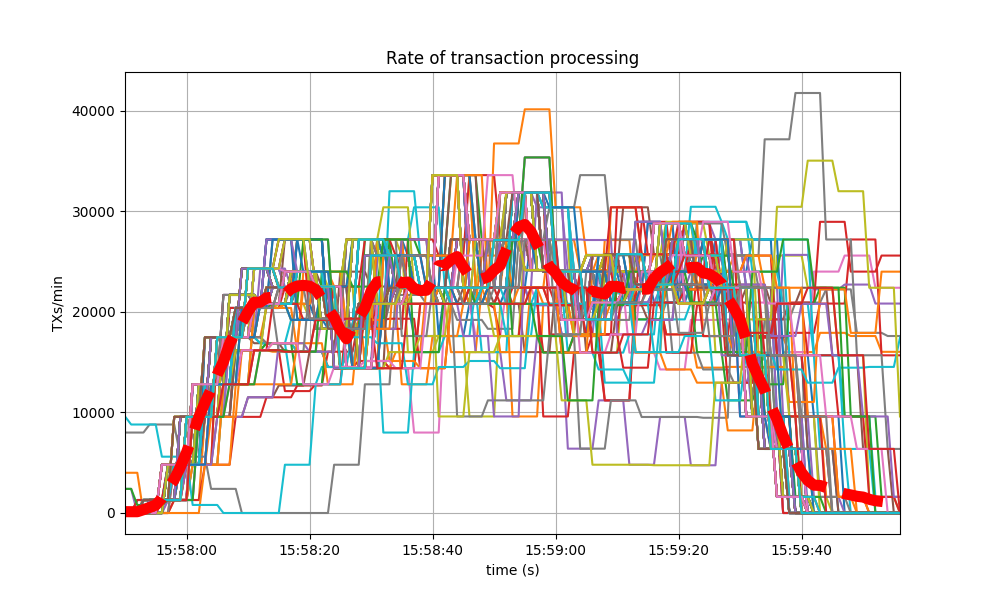

### Memory Resident Set Size

The Resident Set Size of all monitored processes is plotted below, with maximum memory usage of 2GB.

A similar behavior was shown in the baseline, presented next.

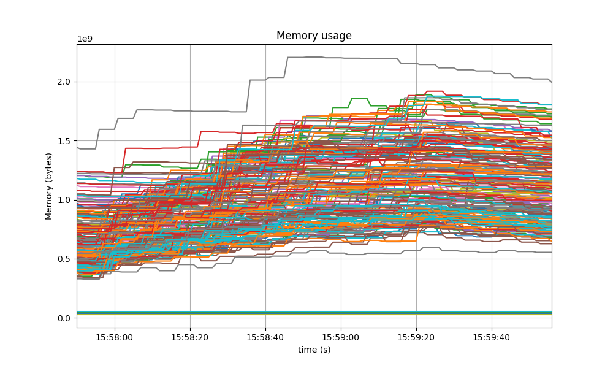

The memory of all processes went down as the load as removed, showing no signs of unconstrained growth.

#### CPU utilization

The best metric from Prometheus to gauge CPU utilization in a Unix machine is `load1`,
as it usually appears in the
[output of `top`](https://www.digitalocean.com/community/tutorials/load-average-in-linux).

It is contained below 5 on most nodes, as seen in the following graph.

A similar behavior was seen in the baseline.

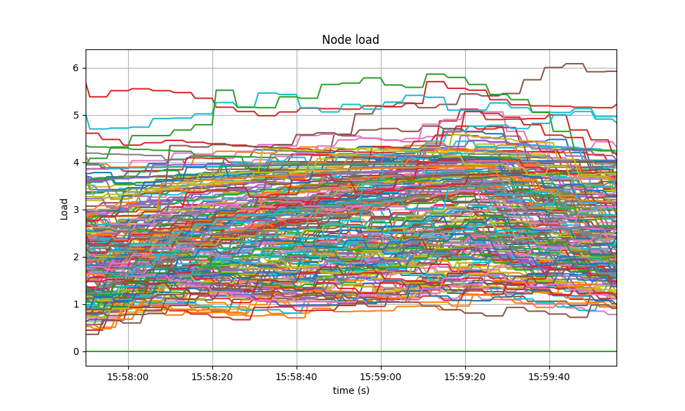

## Test Results

The comparison against the baseline results show that both scenarios had similar numbers and are therefore equivalent.

A conclusion of these tests is shown in the following table, along with the commit versions used in the experiments.

| Scenario | Date | Version | Result |
|--|--|--|--|
|CometBFT | 2023-02-14 | v0.37.0-alpha3 (bef9a830e7ea7da30fa48f2cc236b1f465cc5833) | Pass

[\#9548]: https://github.com/tendermint/tendermint/issues/9548
